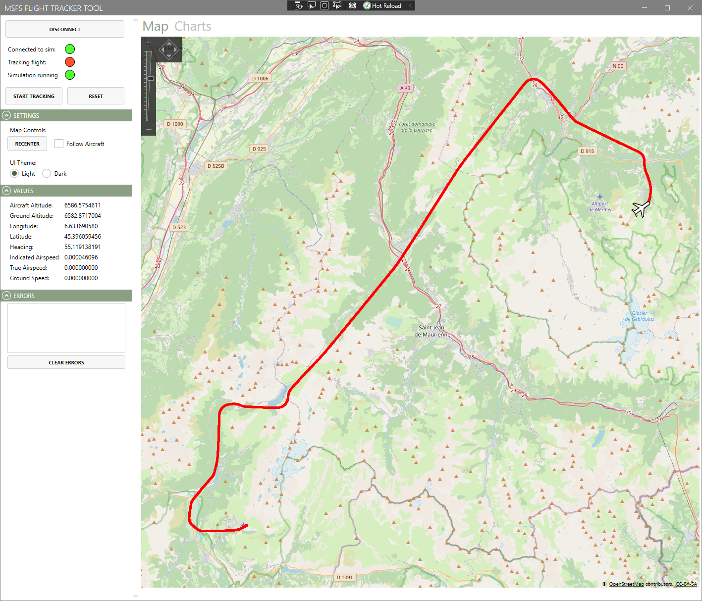
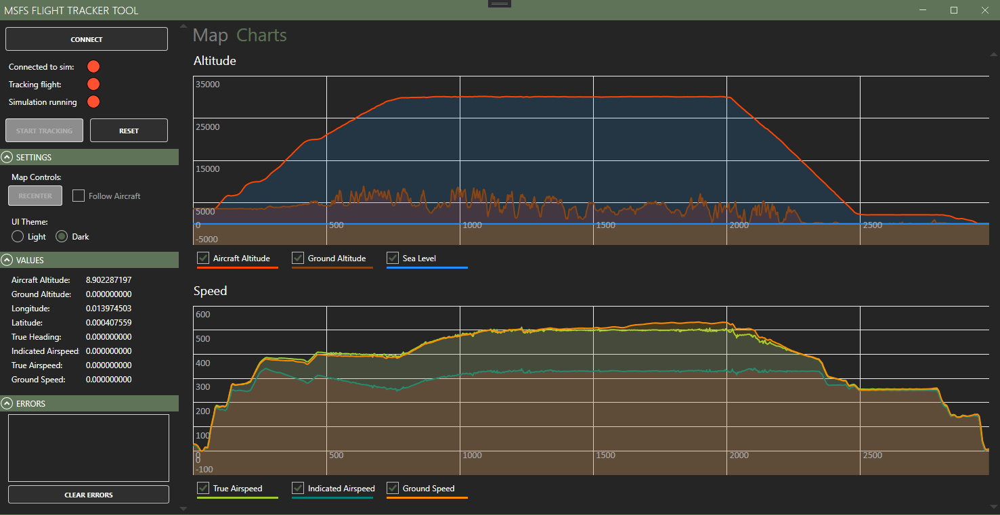
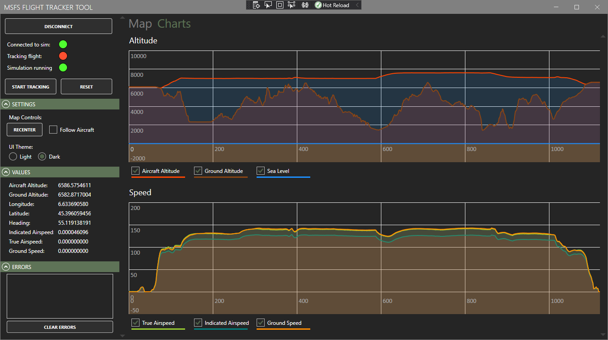

# MSFS Flight Tracker Tool
Generate maps and charts in real-time for your flights:

Also in dark mode:

# Installation Instructions
1. Install .NET 4.7.2 if needed - download here: https://dotnet.microsoft.com/download/dotnet-framework/net472
2. Download and extract the zip file from the releases section of this project: https://github.com/fiftysixkbit/MSFS_FlightTracker/releases
3. Launch MSFS_FlightTracker.exe to start the tool
